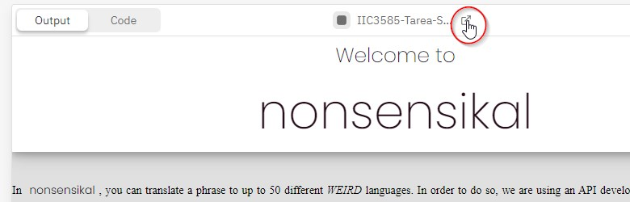

# Tarea 6 IIC3585
**Grupo 12: Page&Brin**

Integrantes:
- Noemi Crosby
- Tomás Mellado
- Maximiliano Friedl

---

La tarea fue desarrollada en [replit](https://replit.com/). Por lo que este código puede verse en dos formatos diferentes:

1. Código local: Se puede correr el código presente en este repositorio instalando las dependencias y activando un servidor local por medio de los siguientes comandos

```bash
npm install
npm run dev
```

2. Código en Replit: Se puede ver el código y ejecutar la _app_ desde Replit en el siguiente [link](https://replit.com/@MaximilianoFrie/IIC3585-Tarea-Svelte?v=1). Además, se recomienda hacer _click_ en el botón destacado en la imágen, para poder ver el resultado en pantalla completa.



Por último, el video con la presentación de la tarea se puede encontrar en el siguiente [link](https://drive.google.com/file/d/1H54fizm-Awao0DPOYmRzcyG0SoYbH3l3/view?usp=sharing).
